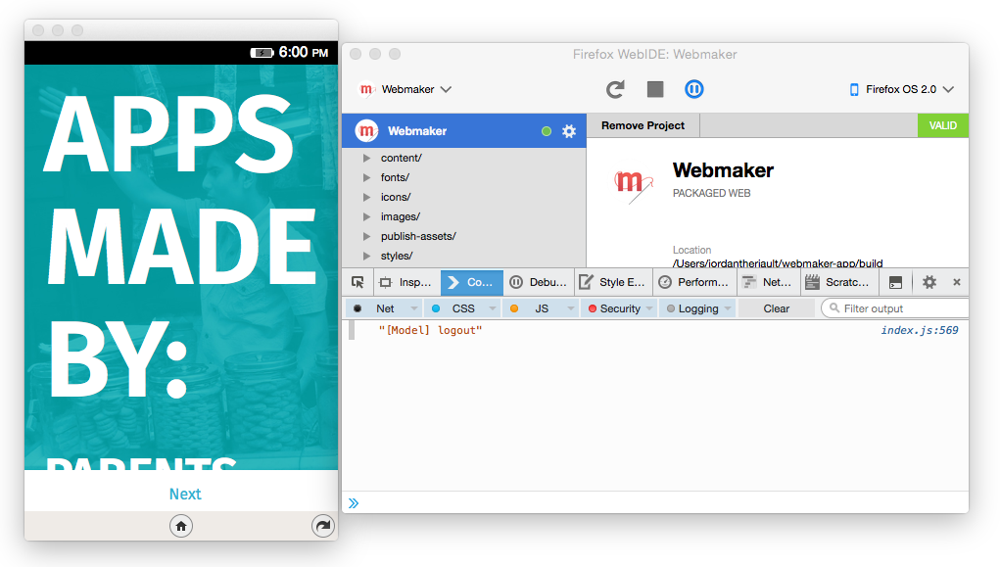

# Developing Mobile Webmaker with Firefox WebIDE

###Overview

Firefox WebIDE allows you to emulate Firefox OS using your browser and run Firefox OS applications for testing. It also includes a debugging tool.

###Install Firefox Nightly

Firefox nightly is an experimental build of Mozilla's Firefox web browser made for testing purposes. Nightly includes new tools and features to use including Mozilla's WebIDE.

In order to use Firefox WebIDE, you need to have nightly installed. You can download it here: [Download :arrow_down:](https://nightly.mozilla.org/)

###Opening WebIDE

In the Web Developer menu, click on the WebIDE entry and the WebIDE opens. 

You can also use the keybinding: 

*Mac*: Shift-fn-F8.

*Windows*: Shift-F8

###Installing Firefox OS Simulator

1. On the top right, select `Select Runtime -> Install Simulator` and from the list install "Firefox OS 2.0 Simulator"
2. Press "Close" in the top right to get back to the first screen

###Select Mobile Webmaker Project

1. On the top left select `Open App -> Open Packaged App`
2. Select `webmaker-app -> build` 
3. The application information should appear on the screen with a green "Valid" in the top right.

*Note:* You **must** select the build folder for the simulator to work.

###Run Mobile Webmaker

1. Select run the Simulator by selecting it from "Select Runtime" on the top right of the window.
2. Press "Install and Run" 

###Debugging Tool

The debugging tool can be accessed by pressing the pause button  while the application is running.

###Learn More

For more information on the WebIDE, [check out this page](https://developer.mozilla.org/en-US/docs/Tools/WebIDE).
